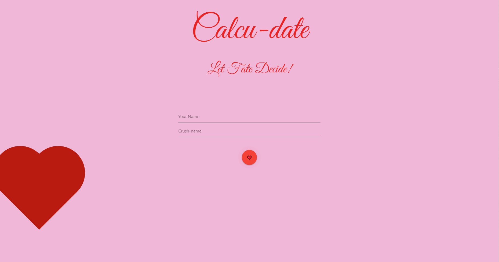
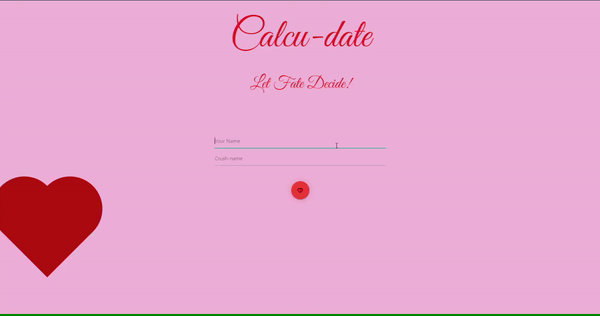

# Calcu-date

1. Elevator Pitch:

Our app is a throwback, an homage to the fortune telling we did as children, like a magic 8-ball. We have brought multiple API’s together to create a one-stop shop for choosing a first date in a nostalgic, novelty sort of way. The way in which the two main API’s interact adds to the fun.

2. Concept:

We went through many ideas before landing on this one, the others were good ideas for useful apps but were all kind of boring/ mundane. We decided to go for not a necessarily “useful” idea, but a fun one. We have childhood memories of magic 8-balls and paper fortunes and this is what the concept reminded us of.  We knew we needed a signature centerpiece that stayed with the app as you navigate through it, so we designed a pulsating “pounding heart” button and themed the entire app accordingly. The concept is simply one app that gives you the resources to create a first date. Once you put in the two names, we have connected the two API’s so that based on the percentage result you receive, it will recommend a specific movie genre. For example, if you and your dates match is only 12%, it might recommend horror movies. If the match was 89%, it might recommend romantic comedies. We rounded the app out with a simple 3rd API which provides a random recipe to cook on your date.

3. Process:

Challenges: Working on an app as a group for the first time proved challenging in some ways. We struggled a lot with our gitflow. Branching, pushing, and pulling seemed to give us all different results each time, and we had to re-clone the files to our computers multiple times. Practicing the gitflow more will help us with these issues. We also struggled a lot with finding API’s that were actually still functioning. We went through 4 other ideas, making a plan and then realizing the API we had chosen had stopped functioning in 2017, or cost 200 dollars per month. 

Successes: Since we were having so much trouble with the gitflow, we decided to designate specific people to work on specific files, with a lot of pair coding over zoom. This way, only one computer was actually pushing the file into github. Once we all understand the gitflow better, this won’t be necessary. The git manager was in charge of the files and the project manager delegated tasks and approved pull requests. It was a very collaborative process!

4. Demo:

Show first page, name inputs, mention the pulsating heart button as the centerpiece
Click to 2nd page to show the percentage match, heart button to retry a different match
Show first tab, movie tab for date recommendations
Show second tab, a randomized love quote for inspiration
Show third tab for recipes

5. Future Dev:

We thought about adding a googlemaps/ yelp type API to recommend a local romantic restaurant, that would add even more options for a first date.
Adding code to embed video trailers into the movie section would also enhance the experience
We also thought about adding astrology/ horoscope info for the two names, there are API’s that function in this way.

LINKS:

https://github.com/MiaYun98/Calcu-date
https://miayun98.github.io/Calcu-date/

## Description

We decided to go for a fun, cheeky app that has some nostalgiac elements reminiscent of the magic 8 balls/ fortune teller machines we played with as kids, but also has the added usability of being able to search the streaming libraries for a good first date movie. the pulsating heart button is the centerpiece of this app, and stays on the center of the page as you navigate. The love calculator API gives a unique result based on the two inputs (names) that are used. These results are a percentage match and a note about that match. We then used the percentage result to from this API to dictate to our 2nd API which type of movie to recommend (example: a 17% match would recommend a horror movie while a 89% match would recommend a romantic comedy).

## User Story

```
AS A single person
I WANT to know how compatible I am with a potential partner and get a movie recommendation for the first date
SO THAT I won't be single anymore
```

## Acceptance Criteria

```
GIVEN I visit the app
WHEN I am on the homepage
THEN I am greeted with the search bar
WHEN I search our names
THEN our love comparability will display
WHEN I have found a good love match
THEN I can search for a streaming movie for a first date.
WHEN I have found a poor match
THEN I can hit the button again to retry
```

## Langauges

HTML, CSS, JavaScript

## Usage

For entertainment purposes and movie searches

## App Screenshot



## Live Website


https://miayun98.github.io/Calcu-date/

## Contact

* Bryan Gholipour: https://github.com/bryangholipour 

* Eillen Lu: https://github.com/Eile8 

* Sangmi Yun: https://github.com/MiaYun98 

* Tiffany Marko: https://github.com/Tiffany-Marko
